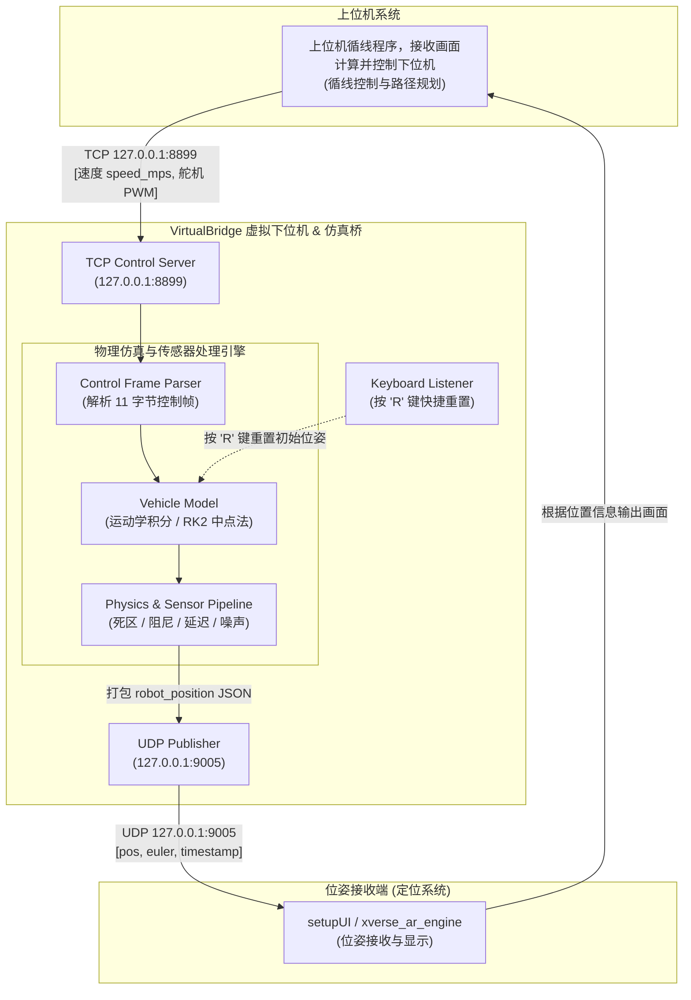

# XSmart_Car_VirtualBridge

> [!IMPORTANT]
> **使用须知与仿真局限性说明**
> 本项目仅提供在低速工况下的车辆运动学及基础物理特性（如起步死区、阻尼滑行、传输延迟与高频噪声）的近似模拟，**不能代替实际调车使用**。它适用于快速验证上位机控制算法逻辑、调试通信闭环链路，以及观察小车在较为理想或常规状态下的运行表现。

`VirtualBridge` 是上位机循线控制程序的虚拟下位机和虚拟定位桥接程序。它用于在没有真实小车、真实串口下位机和真实 ArUco 相机定位系统时，闭环测试上位机循线控制算法与通信链路。

程序负责三件事：

1. 监听上位机原本发送给下位机通信桥接程序的 TCP 控制帧，解析速度和舵机 PWM。
2. 使用低速车辆运动学模型积分出虚拟小车位置，并按 `ArucoCalibCpp` 兼容的 `robot_position` UDP 格式发送给板卡上的定位接收程序。
3. 支持运行过程中随时按 **'R'** 键（或小写 **'r'**）将小车坐标与朝向快速重置为初始配置值，无需重启程序。

虚拟闭环数据流向如下：



使用虚拟桥时，不要同时启动真实的下位机通信桥接程序。两个程序都会占用 `127.0.0.1:8899`，而且真实桥接程序会把控制指令发到物理小车。

## 项目结构

```text
VirtualBridge/
├── CMakeLists.txt
├── README.md
├── config/
│   └── virtual_bridge.json
├── include/virtual_bridge/
│   ├── AppConfig.hpp
│   ├── ControlFrame.hpp
│   ├── RobotPositionJson.hpp
│   ├── TerminalStatus.hpp
│   └── VehicleModel.hpp
├── src/
│   ├── AppConfig.cpp
│   ├── ControlFrame.cpp
│   ├── RobotPositionJson.cpp
│   ├── TerminalStatus.cpp
│   ├── VehicleModel.cpp
│   └── virtual_aruco_bridge.cpp
└── tests/
    └── virtual_bridge_tests.cpp
```

主要文件说明：

- `AppConfig.hpp` / `AppConfig.cpp`

  读取 `config/virtual_bridge.json`。配置格式是带 `//` 注释的 JSON 风格。

- `ControlFrame.hpp` / `ControlFrame.cpp`

  解析上位机输出的 11 字节二进制控制帧，帧内包含 `float speed_mps` 和 `uint16 servo_pulse_us`。

- `VehicleModel.hpp` / `VehicleModel.cpp`

  维护虚拟车辆状态。模型以后轮轴中心为积分参考点，再输出配置指定的定位点。

- `RobotPositionJson.hpp` / `RobotPositionJson.cpp`

  生成 `ArucoCalibCpp` 兼容的 UDP JSON 数据：

  ```json
  {"type":"robot_position","pos":[x,0.0000,z],"euler":[0.0,yaw,0.0],"t_aruco_emit_ns":123}
  ```

- `TerminalStatus.hpp` / `TerminalStatus.cpp`

  生成终端状态面板。交互终端中会用固定位置刷新，避免持续刷屏。

- `virtual_aruco_bridge.cpp`

  程序入口。它启动 TCP 控制服务器、运行车辆模型循环、发送 UDP 位姿数据，并刷新终端状态。

- `virtual_bridge_tests.cpp`

  回归测试，覆盖控制帧解析、舵机角度映射、车辆模型积分、定位点偏移、JSON 输出、配置读取和终端状态渲染。

## 车辆模型

模拟器使用低速运动学自行车模型。默认参数写在 `config/virtual_bridge.json` 中：

- 后轮轴中心是积分参考点。
- 前后轮轴距：`0.20 m`。
- 左右后轮轮距：`0.155 m`。
- 定位点：后轮轴中心前方 `0.075 m`。
- 舵机中位脉宽：`1500 us`。
- 舵机脉宽范围：`2000 us`，对应 `500..2500 us` 的 `0..180 deg`。
- 前轮最大转角：`36 deg`。
- 舵机速度模型：`0.16 s / 60 deg`。
- 默认定位高度：`0.0 m`。

这个模型适合：

- 测试完整的控制和坐标反馈闭环。
- 检查循线路径逻辑是否能收敛。
- 检查转向极性和坐标朝向约定。
- 做低速路线仿真。

它不会模拟：

- 轮胎打滑。
- 电机死区。
- 电池电压变化。
- 舵机连杆非线性。
- 机械间隙。
- 轮胎摩擦和复杂地面接触。

如果虚拟运动和实车差异较大，优先结合实车数据调整这些配置项：

- `vehicle.speed_scale`
- `vehicle.speed_tau_s`
- `vehicle.max_accel_mps2`
- `vehicle.max_steering_deg`
- `vehicle.steering_sign`

## 配置文件

默认读取：

```text
config/virtual_bridge.json
```

配置文件是带注释的 JSON，支持 `//` 注释。常用配置段如下：

- `control`：TCP 控制端点，供上位机循线控制程序连接。
- `udp`：`robot_position` UDP 输出目标。
- `initial_pose`：初始定位点和车头朝向。
- `vehicle`：轴距、轮距、定位点偏移、舵机 PWM 映射和速度响应参数。
- `physics_enhancements`：基于易收集实车物理参数的增强仿真选项（带模式切换开关 `enabled`）。
- `robot_position`：输出坐标映射和 yaw 约定。
- `runtime`：运行时显示行为。

### 物理模拟模式选择

通过 `config/virtual_bridge.json` 中的 `physics_enhancements.enabled` 开关可在两种模拟模式之间自由切换：

- **`enabled: false`（默认/经典模式）**：沿用老版本的理想几何运动学模型（无电机死区、无自然滑行摩擦、理想舵机中位与无迟滞传输）。适合快速闭环验证基础逻辑。
- **`enabled: true`（物理增强模式）**：启用包含电机起步死区、松油门自然滑行减速、舵机中位偏置与死区、传感器传输延迟以及高频定位抖动在内的逼真仿真，所有参数均可通过电子秤、直尺等简单手段收集测量。

```jsonc
"physics_enhancements": {
  // 设为 false 沿用经典理想模拟；设为 true 开启基于实车物理参数的物理仿真
  "enabled": true,
  "vehicle_mass_kg": 1.25,        // 整备质量 (kg)
  "min_start_speed_mps": 0.06,    // 电机起步速度死区 (m/s)
  "coasting_decel_mps2": 0.8,     // 松油门自然机械滑行减速度 (m/s^2)
  "servo_trim_us": 0,             // 舵机中位偏置 (us)
  "servo_deadband_us": 12.0,      // 舵机机械死区 (us)
  "sensor_latency_ms": 40.0,      // 定位传输与处理延迟 (ms)
  "position_noise_m": 0.002,      // 定位坐标高频抖动标准差 (m)
  "yaw_noise_deg": 0.3            // 定位角度高频抖动标准差 (deg)
}
```

也可以通过命令行参数 `--enable-physics` 或 `--disable-physics` 临时覆盖配置中的开关。

当前已验证链路的默认值：

```jsonc
"control": {
  "bind_ip": "127.0.0.1",
  "port": 8899
},
"udp": {
  "host": "127.0.0.1",
  "port": 9005,
  "send_hz": 90.0
},
"initial_pose": {
  "world_x_mm": 315.0,
  "world_y_mm": 1077.0,
  "heading_deg": 350.0
}
```

切换不同硬件时，主要修改 `vehicle`：

```jsonc
"vehicle": {
  "wheelbase_m": 0.20,
  "rear_track_m": 0.155,
  "pose_offset_m": 0.075,
  "servo_mid_us": 1500,
  "servo_span_us": 2000.0,
  "max_steering_deg": 36.0
}
```

命令行参数仍然可用。程序会先读取配置文件，再用命令行参数覆盖对应值。

## 编译

在板卡上执行：

```bash
cd ~/Desktop/VirtualBridge
cmake -S . -B build
cmake --build build -j$(nproc)
ctest --test-dir build --output-on-failure
```

编译产物：

- `build/virtual_aruco_bridge`：主程序。
- `build/virtual_bridge_tests`：测试程序。

## 启动流程

### 1. 启动 setupUI / 位姿接收端

先启动板卡上负责接收 ArUco 定位数据的程序，并确认接收端口。当前已验证可用端口是 `9005`：

```bash
ss -lunp | grep -E '9005'
```

如果看到进程监听 `0.0.0.0:9005`，保持 `config/virtual_bridge.json` 中的 `udp.port` 为 `9005`。

### 2. 启动 VirtualBridge

默认配置已经写入可用链路，所以通常只需要：

```bash
cd ~/Desktop/VirtualBridge
./build/virtual_aruco_bridge
```

注意：

- `control.port` 必须与上位机发出的 TCP 控制端口保持一致。
- `udp.host` 和 `udp.port` 必须指向板卡上的位姿接收端。
- 不要同时启动真实的下位机通信桥接程序。

如果要临时使用其他配置文件：

```bash
./build/virtual_aruco_bridge --config config/my_car.json
```

如果只想临时覆盖少量参数：

```bash
./build/virtual_aruco_bridge --udp-port 9005 --initial-heading-deg 350
```

### 3. 启动上位机程序

## 终端显示与交互控制

默认非静默模式下，如果程序运行在交互终端中，会显示一个固定位置刷新的状态面板，而不是持续追加日志行。

### 快捷键控制

程序在运行过程中支持以下键盘交互指令（无需按 Enter）：

- **`R` 或 `r`**：将虚拟小车的坐标 ($x, y$) 和车头朝向 ($\theta$) 瞬间重置为启动时指定的初始位姿（包含配置文件或命令行参数传入的初始位姿），方便在循线或导航测试中重新开始，而无需重启程序。
- **`Ctrl + C`**：优雅退出 VirtualBridge。

### 状态面板

状态面板包含：

- 配置文件路径。
- TCP 控制端口和连接状态。
- UDP 位姿输出目标和发送频率。
- 当前定位点坐标和朝向。
- 后轮轴速度和前轮转角。
- 最新控制指令中的速度、舵机 PWM 和控制帧计数。
- UDP 发送错误计数。

如果标准输出不是交互终端，例如被重定向到文件或由脚本捕获，程序会自动退回普通文本输出，避免把 ANSI 控制字符写入日志文件。

完全关闭周期性显示：

```bash
./build/virtual_aruco_bridge --quiet
```

也可以在配置中设置：

```jsonc
"runtime": {
  "quiet": true
}
```

## 初始位姿

初始位姿写在 `config/virtual_bridge.json`：

```jsonc
"initial_pose": {
  "world_x_mm": 315.0,
  "world_y_mm": 1077.0,
  "heading_deg": 350.0
}
```

这里的坐标描述的是定位点，不是后轮轴中心。定位点位于后轮轴中心前方 `vehicle.pose_offset_m`。

`world_x_mm` 和 `world_y_mm` 使用 ArUco 世界坐标，单位是毫米。`heading_deg` 表示虚拟小车车头方向。

如果你从旧的 `ArucoCalibCpp` 原始日志复制 `yaw_deg`，需要先加 `180 deg` 再填入 VirtualBridge，因为旧 raw yaw 是从 marker 边方向计算的，不是小车车头方向。

示例：

```text
旧 ArUco raw yaw_deg = 170
VirtualBridge initial heading = 170 + 180 = 350
```

写到配置里就是：

```jsonc
"heading_deg": 350.0
```

## 坐标输出约定

默认输出映射匹配当前已验证的 `ArucoCalibCpp/config.yaml` 约定：

```text
robot_position.pos[0] = world_y_m
robot_position.pos[1] = height_m
robot_position.pos[2] = world_x_m
robot_position.euler[1] = heading_deg
```

对应配置：

```jsonc
"robot_position": {
  "height_m": 0.0,
  "pos_x_source": "world_y",
  "pos_x_sign": 1.0,
  "pos_z_source": "world_x",
  "pos_z_sign": 1.0,
  "yaw_offset_deg": 0.0,
  "yaw_sign": 1.0
}
```

如果接收端坐标约定不同，修改这些配置项即可。

## 控制输入格式（接收下位机/上位机控制帧格式）

VirtualBridge 通过 TCP 服务器（默认端口 `8899`）接收来自上位机循线程序（或测试端）的控制指令。通信协议与下位机通信桥接程序保持完全一致。

每条控制指令固定为 **11 字节** 二进制控制帧，布局如下：

| 字节偏移 (Offset) | 数据类型 (Type) | 字段名 (Field)              | 默认/固定值 | 描述 (Description)                                                        |
| ----------------- | --------------- | --------------------------- | ----------- | ------------------------------------------------------------------------- |
| `byte 0`          | `uint8`         | 帧头标志 (Header)           | `0x42`      | 帧起始标志字符 (`'B'`)                                                    |
| `byte 1`          | `uint8`         | 设备地址 (Address)          | `0x01`      | 控制目标设备地址 (小车控制)                                               |
| `byte 2`          | `uint8`         | 数据长度 (Length)           | `0x0A` (10) | 有效载荷及校验和总长度                                                    |
| `byte 3..6`       | `float32` (LE)  | 目标速度 (`speed_mps`)      | 浮点数      | 小端序 (Little-Endian) IEEE 754 32位单精度浮点数，单位 `m/s`              |
| `byte 7..8`       | `uint16` (LE)   | 舵机脉宽 (`servo_pulse_us`) | 无符号整数  | 小端序 16位无符号整数，单位微秒 (`us`)，范围通常 `500..2500`，中位 `1500` |
| `byte 9`          | `uint8`         | 校验和 (Checksum)           | 8位累加和   | 前 9 个字节（`byte 0` 至 `byte 8`）的无符号累加和模 256                   |
| `byte 10`         | `uint8`         | 保留字节 (Reserved)         | -           | 原始协议结构保留字节（通常为 `0x00`）                                     |

### 校验和算法

帧校验和通过计算前 9 个字节的无符号 8 位累加和得出：

$$\text{checksum} = \left( \sum_{i=0}^{8} \text{byte}[i] \right) \pmod{256}$$

### 帧解析规则

- **字节流处理**：采用滑动窗口搜索帧头 `0x42`，即使发生 TCP 粘包或半包，程序也会自动提取合法帧。
- **合法性校验**：必须满足 `byte 0 == 0x42`、`byte 1 == 0x01`、`byte 2 == 10`，且累加校验和与 `byte 9` 相匹配。
- **显示确认**：链路正常时，终端状态面板里的 `frames` 计数会持续增加，`servo` 和 `speed` 会更新显示最新的控制参数。如果 `frames=0`，说明未收到有效帧，请检查 TCP 网络连接及发送端启动参数。

## 常用命令

查看命令行参数：

```bash
./build/virtual_aruco_bridge --help
```

临时反转转向极性：

```bash
./build/virtual_aruco_bridge --steering-sign -1
```

临时降低虚拟速度：

```bash
./build/virtual_aruco_bridge --speed-scale 0.7
```

静默运行：

```bash
./build/virtual_aruco_bridge --quiet
```

## 故障排查

### 状态面板里 `frames=0`

说明上位机程序还没有连接到 `127.0.0.1:8899`，或连接后没有发送控制帧。

检查监听端口：

```bash
ss -ltnp | grep 8899
```

确认真实的下位机通信桥接程序没有占用同一个端口。

如果上位机程序有开关选项，请确认已开启控制帧发送功能。

### setupUI 收不到虚拟位姿

检查 UDP 接收端口：

```bash
ss -lunp | grep -E '9005'
```

然后让 `config/virtual_bridge.json` 中的 `udp.port` 匹配实际监听端口。当前已验证链路使用 `9005`。

### 虚拟小车向后走

最常见原因是初始朝向差了 `180 deg`。

如果你复制的是旧 ArUco raw yaw，需要加 `180` 后填入 `initial_pose.heading_deg`。

示例：

```text
错误："heading_deg": 170.0
正确："heading_deg": 350.0
```

### 虚拟小车左右转向相反

修改：

```jsonc
"steering_sign": -1.0
```

### 路线方向正确但偏差较大

优先调这些参数：

```text
vehicle.speed_scale
vehicle.speed_tau_s
vehicle.max_accel_mps2
vehicle.max_steering_deg
```

当前模型是低速运动学模型，不是完整轮胎、电机和地面物理仿真。调参时建议先让速度尺度和最大转角贴近实车，再微调响应时间和加速度限制。
